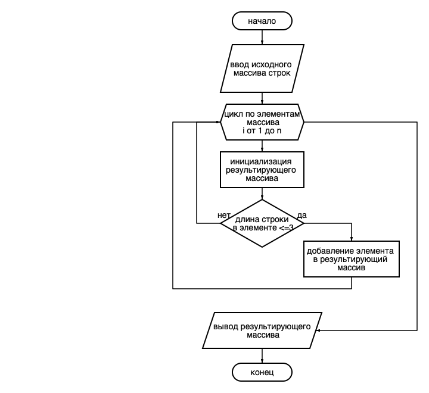

# Генератор массива строк.

Эта программа формирует из имеющегося массива строк новый массив строк с длиной _меньше либо равно 3_.

1. Исходный массив вводится на старте программы. Программа выводит исходный массив.
2. Программа формирует новый массив.
3. Программа выводит новый массив.

